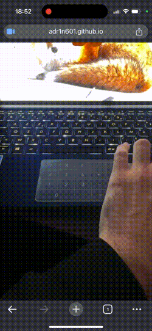

## Adrien AIT ABED [MAP AR]

# Projet Creative Coding (Avancé)

Bienvenue dans le projet **Creative Coding (Avancé)** ! Ce projet explore différentes techniques interactives et expérimentations avec des concepts comme les cartes interactives et la réalité augmentée.

---

## Exercice 1 : Map Interactive 🗺️

Découvrez une **map interactive** qui permet de se déplacer à l'aide d'une fonctionnalité de **drag and drop**.

### Aperçu Vidéo
Voici un aperçu vidéo de l'exercice :  

---

## Exercice 2 : Réalité Augmentée avec Carte de Visite 📇

Découvrez une **première version de la réalité augmentée** appliquée à une carte de visite.

### Image de la Carte de Visite

---

## Exercice 3 : Réalité Augmentée avec Plusieurs Cibles 🎯

Expérimentez la **réalité augmentée** en utilisant **plusieurs cibles** pour explorer des interactions avancées.

### Aperçu Vidéo
Voici une vidéo montrant les tests avec plusieurs cibles :  

### Images des Cibles
- **Cible 1**  
    
  

- **Cible 2**  
  
  

---

## Projet final - Map Pokémon AR 🎮

Pour le projet final, vous pouvez découvrir une **map Pokémon en réalité augmentée** (AR), qui combine les techniques de cartographie interactive avec des éléments de réalité augmentée pour offrir une expérience immersive et ludique. Venez capturer vos Pokémon !

### Images des Cibles
Voici les trois cibles que vous pouvez scanner pour expérimenter la réalité augmentée avec ce projet :

- **Cible 1 - Pokémon**
  

- **Cible 2 - Pokémon**
  

- **Cible 3 - Pokémon**
  

---

## Maquette Figma

Vous pouvez également consulter mes wireframes du projet dans **Figma**.

[**Voir la maquette Figma**](https://www.figma.com/design/RKqqM1etFd7DDgzeLrX1fo/Map_Slider_Pok%C3%A9mon_AR?node-id=0-1&t=MtN0GffFJPX4VCht-1)

---
